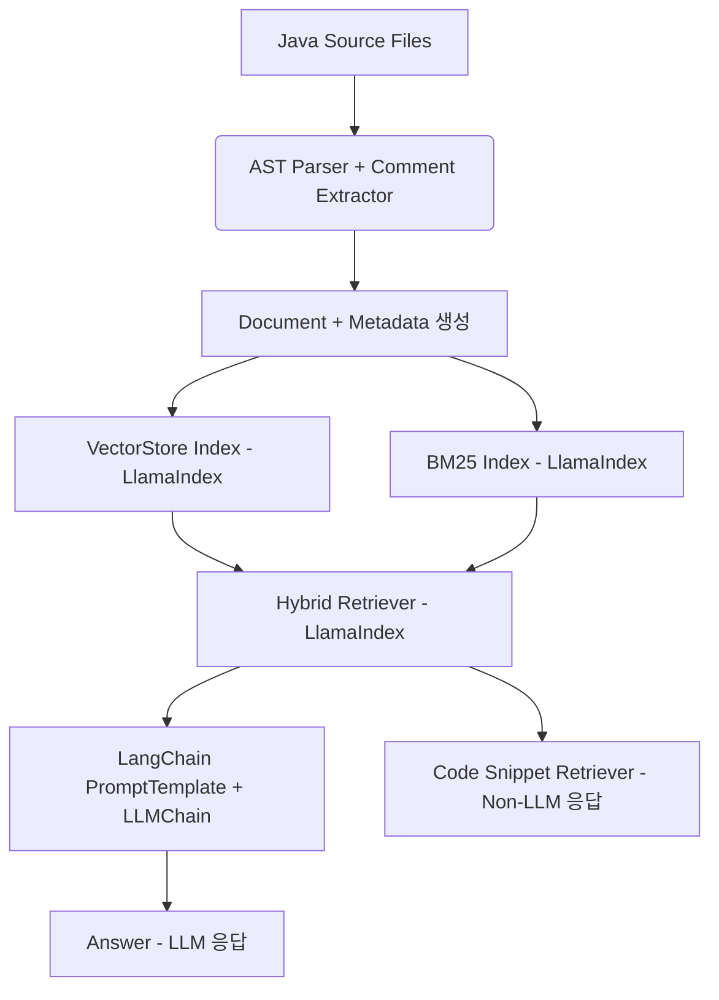

# 📄 RAG 서버 하이브리드 아키텍처 변경계획서

---

## 1. 🎯 변경 개요

현재 RAG 서버는 **기능별 분산 아키텍처**로 구현되어 있으나,  
**LlamaIndex와 LangChain의 하이브리드 아키텍처**로 전환하여  
코드 검색 정확도와 LLM 응답 품질을 향상시키고자 합니다.

### 📊 현재 시스템 분석

| 현재 모듈 | 담당 기능 | 문제점 |
|-----------|-----------|---------|
| `features/indexing` | 코드 파싱, 임베딩, 벡터DB 저장 | 모듈 간 의존성 복잡, 중복 코드 |
| `features/search` | 하이브리드 검색 (BM25 + Vector) | 검색 로직 분산, 통합 관리 어려움 |
| `features/generation` | LLM 기반 코드 생성 | 프롬프트 관리와 분리, 일관성 부족 |
| `features/prompts` | 프롬프트 템플릿 관리 | 생성 로직과 분리, 체인 구성 미흡 |

---

## 2. 🧱 목표 하이브리드 아키텍처



### ✅ 역할 분담 명세

#### LlamaIndex 담당
- **AST 기반 코드 파싱** (Java, Python, JavaScript)
- **Document/Node 생성** (메타데이터 포함 청크)
- **VectorStoreIndex** (임베딩 기반 유사 코드 검색)
- **BM25Retriever** (키워드 기반 정밀 검색)
- **HybridRetriever** (BM25 + Vector 병합 검색)
- **RetrieverQueryEngine** (LLM 없는 순수 검색)

#### LangChain 담당
- **PromptTemplate** (검색 결과 기반 프롬프트 구성)
- **LLMChain** (LLM 호출 및 응답 생성)
- **Tool Integration** (에이전트 시스템 연동)
- **Memory Management** (대화 히스토리 관리)

---

## 3. 📁 새로운 디렉토리 구조

### 🔄 변경 전 → 변경 후

```diff
app/
├── features/
-│   ├── generation/          # 삭제
-│   ├── indexing/            # 삭제  
-│   ├── prompts/             # 삭제
-│   ├── search/              # 삭제
+│   ├── hybrid_rag/          # 새로운 통합 모듈
+│   │   ├── router.py        # 통합 API 엔드포인트
+│   │   ├── service.py       # 하이브리드 오케스트레이션
+│   │   └── schema.py        # 통합 스키마
│   └── users/               # 유지
+├── retriever/              # LlamaIndex 기반 검색
+│   ├── hybrid_retriever.py # BM25 + Vector 통합
+│   ├── ast_parser.py       # Java 메서드 파서
+│   └── document_builder.py # Document/Node 생성
+├── index/                  # LlamaIndex 인덱스 관리
+│   ├── build_index.py      # 문서 생성 + 인덱싱
+│   ├── vector_index.py     # Vector 인덱스
+│   └── bm25_index.py       # BM25 인덱스
+├── llm/                    # LangChain 기반 LLM 처리
+│   ├── langchain_prompt.py # PromptTemplate 구성
+│   ├── llm_chain.py        # LLMChain 구현
+│   └── memory.py           # 대화 히스토리
├── core/                    # 유지
├── db/                      # 유지
└── main.py                  # 유지
```

---

## 4. 🔧 단계별 마이그레이션 계획

### Phase 1: 기반 구조 구축 (1주차)

#### 1.1 새로운 디렉토리 생성
```bash
mkdir -p app/retriever app/index app/llm
```

#### 1.2 LlamaIndex 기반 AST 파서 구현
```python
# app/retriever/ast_parser.py
from llama_index.core import Document
from llama_index.core.node_parser import SimpleNodeParser
import javalang

class JavaASTParser:
    def parse_java_file(self, file_path: str) -> List[Document]:
        # Java AST 파싱 및 메서드 단위 Document 생성
        pass
```

#### 1.3 Document Builder 구현
```python
# app/retriever/document_builder.py
from llama_index.core import Document

class DocumentBuilder:
    def build_from_code_chunks(self, chunks) -> List[Document]:
        # 기존 indexing 모듈의 청크를 Document로 변환
        pass
```

### Phase 2: 인덱스 통합 (2주차)

#### 2.1 Vector Index 구현
```python
# app/index/vector_index.py
from llama_index.core import VectorStoreIndex
from llama_index.vector_stores.qdrant import QdrantVectorStore

class CodeVectorIndex:
    def __init__(self):
        self.vector_store = QdrantVectorStore(...)
        self.index = VectorStoreIndex.from_vector_store(self.vector_store)
```

#### 2.2 BM25 Index 구현  
```python
# app/index/bm25_index.py
from llama_index.retrievers.bm25 import BM25Retriever

class CodeBM25Index:
    def __init__(self):
        self.retriever = BM25Retriever.from_defaults(...)
```

#### 2.3 Hybrid Retriever 구현
```python
# app/retriever/hybrid_retriever.py
from llama_index.core.retrievers import BaseRetriever

class CodeHybridRetriever(BaseRetriever):
    def __init__(self, vector_retriever, bm25_retriever):
        self.vector_retriever = vector_retriever
        self.bm25_retriever = bm25_retriever
    
    def _retrieve(self, query_bundle):
        # BM25 + Vector 결과 병합
        pass
```

### Phase 3: LangChain 통합 (3주차)

#### 3.1 PromptTemplate 구현
```python
# app/llm/langchain_prompt.py
from langchain.prompts import PromptTemplate

class CodePromptBuilder:
    def build_explanation_prompt(self, query: str, code_results: List) -> str:
        template = """
        질문: {query}
        
        관련 코드:
        {code_context}
        
        위 코드를 바탕으로 질문에 답해주세요.
        """
        return PromptTemplate(template=template)
```

#### 3.2 LLMChain 구현
```python
# app/llm/llm_chain.py
from langchain.chains import LLMChain
from langchain.llms import OpenAI

class CodeLLMChain:
    def __init__(self):
        self.llm = OpenAI(...)
        self.chain = LLMChain(llm=self.llm, prompt=self.prompt)
```

### Phase 4: 통합 서비스 구현 (4주차)

#### 4.1 HybridRAG 서비스 구현
```python
# app/features/hybrid_rag/service.py
class HybridRAGService:
    def __init__(self, retriever, llm_chain):
        self.retriever = retriever
        self.llm_chain = llm_chain
    
    async def search_only(self, query: str) -> List[CodeResult]:
        # LLM 없이 검색만 수행
        return await self.retriever.retrieve(query)
    
    async def search_and_explain(self, query: str) -> str:
        # 검색 + LLM 설명 생성
        results = await self.retriever.retrieve(query)
        return await self.llm_chain.run(query=query, results=results)
```

#### 4.2 통합 API 엔드포인트
```python
# app/features/hybrid_rag/router.py
@router.get("/search-snippet")
async def search_code_snippet(query: str):
    """LLM 없이 유사 코드 검색"""
    return await service.search_only(query)

@router.post("/explain")
async def explain_code(request: ExplainRequest):
    """검색된 코드에 대한 설명 생성"""
    return await service.search_and_explain(request.query)
```

### Phase 5: 기존 모듈 제거 및 테스트 (5주차)

#### 5.1 기존 모듈 제거
- `features/generation/` 삭제
- `features/indexing/` 삭제  
- `features/prompts/` 삭제
- `features/search/` 삭제

#### 5.2 통합 테스트
- 기존 API 호환성 테스트
- 성능 비교 테스트
- 정확도 평가 테스트

---

## 5. 🧪 테스트 전략

### 5.1 마이그레이션 테스트
| 테스트 항목 | 현재 시스템 | 새 시스템 | 비교 기준 |
|-------------|-------------|-----------|-----------|
| 인덱싱 속도 | `indexing.service` | `index.build_index` | 처리 시간 |
| 검색 정확도 | `search.service` | `retriever.hybrid_retriever` | 관련성 점수 |
| 응답 품질 | `generation.service` | `llm.llm_chain` | 정성 평가 |

### 5.2 호환성 테스트
- 기존 API 엔드포인트 유지
- 응답 형식 호환성 확인
- 성능 저하 없음 보장

---

## 6. 🚨 위험 관리 계획

### 6.1 데이터 마이그레이션 위험
- **위험**: 기존 벡터 DB 데이터 손실
- **대응**: 데이터 백업 및 점진적 마이그레이션

### 6.2 성능 저하 위험
- **위험**: 새 아키텍처로 인한 성능 저하
- **대응**: 성능 모니터링 및 롤백 계획

### 6.3 API 호환성 위험
- **위험**: 기존 클라이언트 호환성 문제
- **대응**: API 버전 관리 및 점진적 전환

---

## 7. 📈 기대 효과

### 7.1 기술적 개선
- **코드 품질**: 중복 코드 제거, 단일 책임 원칙 준수
- **유지보수성**: 모듈 간 의존성 단순화
- **확장성**: 새로운 언어/기능 추가 용이

### 7.2 기능적 개선
- **검색 정확도**: LlamaIndex 하이브리드 검색 활용
- **응답 품질**: LangChain 기반 체계적 프롬프트 관리
- **개발 효율성**: 통합된 워크플로우

---

## 8. 🎯 마일스톤 및 일정

| 주차 | 마일스톤 | 완료 기준 |
|------|----------|-----------|
| 1주차 | 기반 구조 구축 | AST 파서, Document Builder 구현 |
| 2주차 | 인덱스 통합 | Vector, BM25, Hybrid Retriever 구현 |
| 3주차 | LangChain 통합 | PromptTemplate, LLMChain 구현 |
| 4주차 | 통합 서비스 구현 | HybridRAG 서비스, API 엔드포인트 |
| 5주차 | 마이그레이션 완료 | 기존 모듈 제거, 테스트 통과 |

---

## 9. 🔚 결론

이번 하이브리드 아키텍처 전환을 통해:
- **LlamaIndex**의 강력한 검색 기능 활용
- **LangChain**의 체계적인 LLM 체인 관리
- **모듈 간 의존성 단순화** 및 **코드 품질 향상**
- **확장 가능한 RAG 시스템** 구축

실제 IDE 어시스턴트 수준의 코드 검색 및 설명 생성 시스템을 완성할 수 있습니다.
